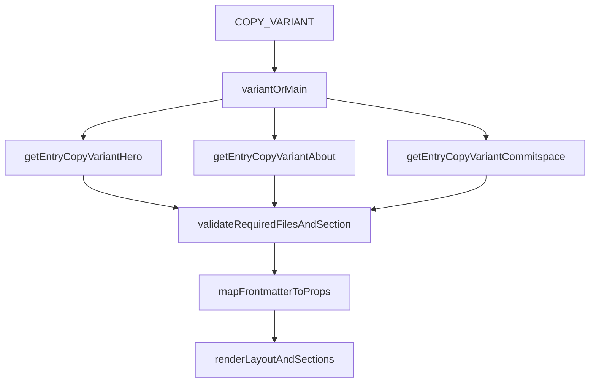

# Content Loading Guide

This doc explains how homepage content is loaded today, where it is validated, and how to safely run copy variants for experiments.

## TL;DR (Product + Content)

- Content lives in `src/content/copy/<variant>/` as three files: `hero.md`, `about.md`, and `commitspace.md`.
- The active variant is chosen by `COPY_VARIANT`; if unset, the app uses `main`.
- Each file must include the correct `section` value in frontmatter (`hero`, `about`, `commitspace`).
- The page renders frontmatter fields mapped to component props. Markdown body content is not rendered by default.
- Fast A/B flow: duplicate `main` -> edit the new variant folder -> run/build with `COPY_VARIANT=<variant-name>`.

## Where Content Is Defined

Content is registered in `src/content.config.ts` as an Astro collection named `copy`:

- Loader: `glob({ pattern: "**/*.md", base: "./src/content/copy" })`
- Validation: `z.discriminatedUnion("section", [...])`
- Sections:
  - `hero`
  - `about`
  - `commitspace`

The schema is the source of truth for allowed frontmatter keys and required fields.

## Runtime Loading Flow

`src/pages/index.astro` controls loading and rendering:

1. Resolve variant:
   - `const variant = import.meta.env.COPY_VARIANT ?? "main";`
2. Load expected entries:
   - `getEntry("copy", `${variant}/hero`)`
   - `getEntry("copy", `${variant}/about`)`
   - `getEntry("copy", `${variant}/commitspace`)`
3. Fail fast if any required file is missing.
4. Validate each file declares the correct `section`.
5. Map `entry.data` to component props and render the homepage.

## Component Coupling Map

The mapping is explicit in `src/pages/index.astro`:

- `hero.data.meta` -> `src/layouts/Layout.astro` (`title`, `description`)
- `hero.data.nav` -> `src/components/Nav.astro`
- `hero.data.*` (headline, subtext, CTAs) -> `src/components/Hero.astro`
- `about.data.*` -> `src/components/AboutVolition.astro`
- `commitspace.data.*` -> `src/components/CommitSpace.astro`

Important coupling notes:

- Anchor links in content should match section IDs in components (`#commitspace`, `#work-with-us`).
- `Nav` still has a hardcoded `About` link.
- `Footer` links are currently hardcoded and not driven by the content collection.

## Editing and A/B Variant Runbook

### Update Existing Copy (Main)

1. Edit frontmatter in:
   - `src/content/copy/main/hero.md`
   - `src/content/copy/main/about.md`
   - `src/content/copy/main/commitspace.md`
2. Run `npm run dev`.
3. Verify sections, links, and CTA destinations in the browser.

### Create a Copy Variant

1. Duplicate `src/content/copy/main/` to `src/content/copy/<variant-name>/`.
2. Edit only the frontmatter keys you want to test.
3. Run locally with:
   - `COPY_VARIANT=<variant-name> npm run dev`
4. Build/test with:
   - `COPY_VARIANT=<variant-name> npm run build`
5. In deployment, set `COPY_VARIANT` in environment variables for the target environment.

## Guardrails and Common Pitfalls

- Missing one of the required files (`hero.md`, `about.md`, `commitspace.md`) causes runtime failure.
- Wrong `section` discriminator (for example `section: hero` inside `about.md`) causes runtime failure.
- Changing frontmatter key names requires coordinated updates in both:
  - `src/content.config.ts` (schema)
  - `src/pages/index.astro` (prop mapping)
- Markdown body content below frontmatter is currently not rendered by these components. Assume frontmatter is the effective content source unless rendering logic is changed.
- If copy links change, verify they still target existing IDs in rendered sections.

## Pre-Merge Checklist for Content Changes

- [ ] Variant folder contains all three required files.
- [ ] Each file has the correct `section` discriminator.
- [ ] Frontmatter keys match `src/content.config.ts`.
- [ ] `COPY_VARIANT` is set correctly for local test/build.
- [ ] Anchor links and CTA URLs work in browser.
- [ ] SEO title/description still make sense (`hero.meta` -> `Layout`).

